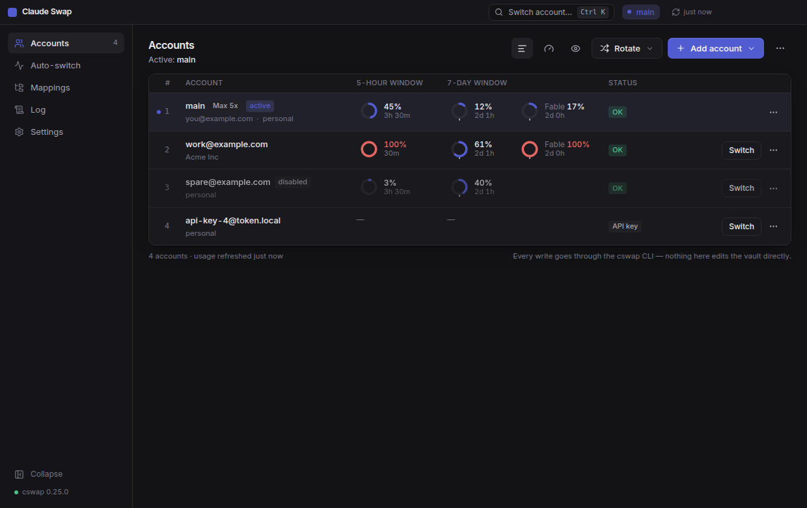
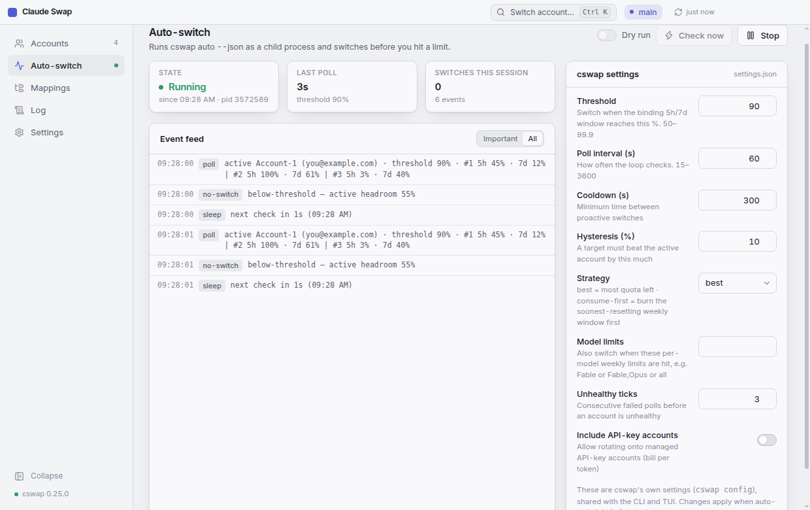
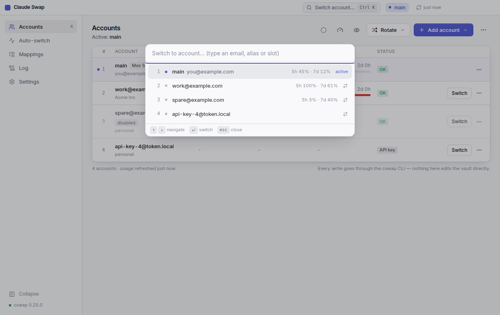
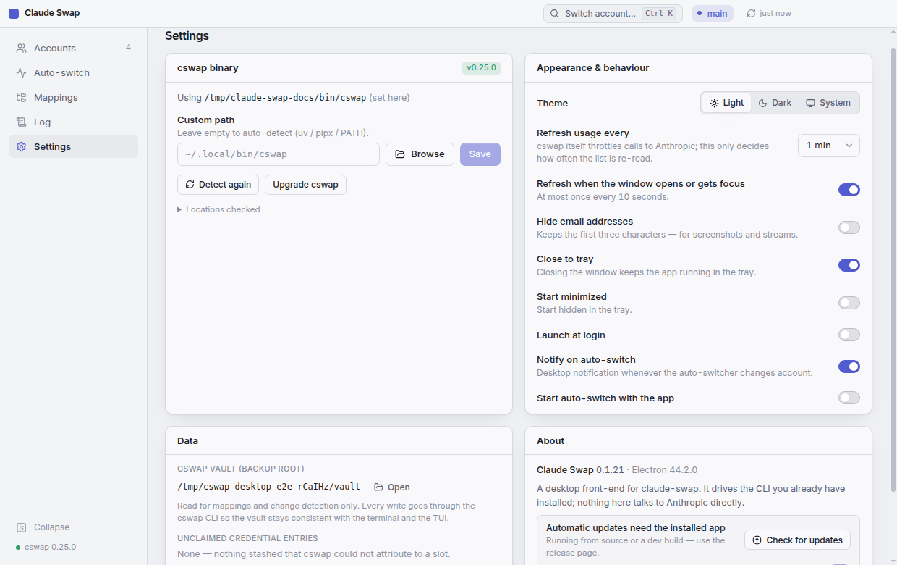
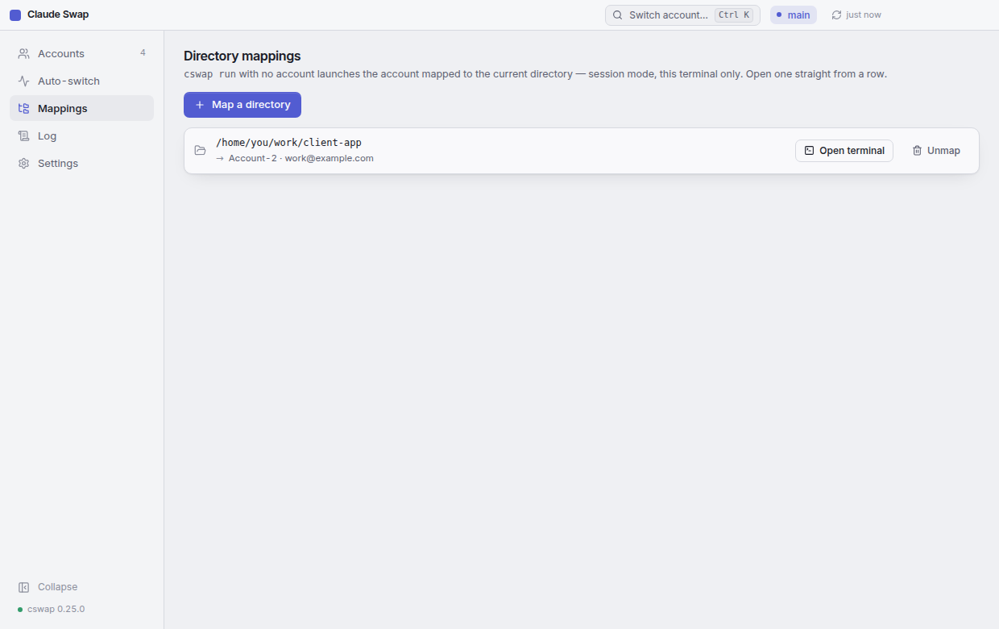
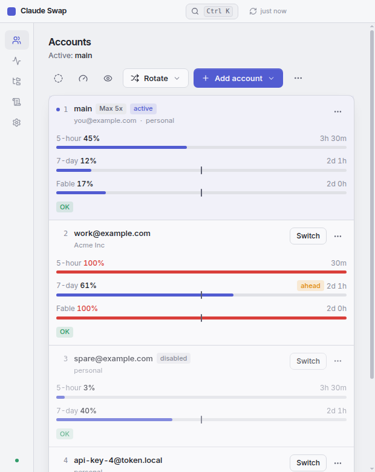

# Claude Swap

A desktop app for [claude-swap](https://github.com/realiti4/claude-swap) (`cswap`) — manage and switch your Claude Code accounts without the terminal.

[](https://github.com/TheSkinnyRat/cswap-desktop/releases/latest)
[](https://github.com/TheSkinnyRat/cswap-desktop/releases)
[](https://github.com/TheSkinnyRat/cswap-desktop/actions/workflows/ci.yml)
[](LICENSE)


## Get started

**1. Install cswap** — the app drives the CLI rather than bundling it, so one install serves the terminal, the TUI and this window:

```bash
uv tool install claude-swap     # or: pipx install claude-swap
```

If cswap is missing when the app starts, it offers to run that install for you.

**2. Download Claude Swap** — always the latest release:

| Platform | Download |
| --- | --- |
| Windows | [Installer (.exe)](https://github.com/TheSkinnyRat/cswap-desktop/releases/latest/download/claude-swap-desktop-win-x64-setup.exe) · [Portable (.exe)](https://github.com/TheSkinnyRat/cswap-desktop/releases/latest/download/claude-swap-desktop-win-x64-portable.exe) |
| Linux | [AppImage](https://github.com/TheSkinnyRat/cswap-desktop/releases/latest/download/claude-swap-desktop-linux-x86_64.AppImage) · [.deb](https://github.com/TheSkinnyRat/cswap-desktop/releases/latest/download/claude-swap-desktop-linux-amd64.deb) |
| macOS | [Apple silicon (.dmg)](https://github.com/TheSkinnyRat/cswap-desktop/releases/latest/download/claude-swap-desktop-mac-arm64.dmg) · [Intel (.dmg)](https://github.com/TheSkinnyRat/cswap-desktop/releases/latest/download/claude-swap-desktop-mac-x64.dmg) |

Every build is unsigned, so Windows SmartScreen and macOS Gatekeeper will want a confirmation the first time. Windows and Linux update themselves from here; macOS cannot without a signature, so it checks and links you back to the release.

**3. Add your first account** — log into Claude Code (`claude`, then `/login`), then **Add account → From the current Claude login**. Repeat for each account you want to keep.

## What it does

- **Accounts** — every managed account with its 5-hour and 7-day windows, per-model weekly limits, reset countdowns, a pace marker showing where an evenly-spread week would be, subscription (Pro / Max 5x / Max 20x) and status (token expired, API key, …), as bars or as rings. Switch with one click, rotate to the next / best / next-available account, or hit <kbd>Ctrl</kbd>+<kbd>K</kbd> and type.
- **Add / remove** — from the current Claude Code login, or from a setup-token / API key (handed to cswap over stdin, never on the command line). Aliases, slot moves and swaps, disable / enable (hold an account out of rotation).
- **Auto-switch** — runs `cswap auto --json` as a child process, shows its event stream live, edits cswap's own settings (`threshold`, `strategy`, `model`, …) and sends a desktop notification when it switches. **Check now** runs a single `cswap auto --once` tick.
- **Session mode** — open a terminal running `cswap run <slot>` from an account's menu or straight from a mapped directory, choosing where it starts (that terminal only; the default login is untouched).
- **Token diagnostics** — `cswap list --token-status` in a dialog when a token misbehaves.
- **Directory mappings** — see and edit the `cswap map` table for session mode.
- **Export / import** — `.cswap` backups, single account or all, `--full` and `--force` as switches.
- **Tray** — active account and usage in the tooltip, switch from the tray menu, close-to-tray, launch at login.
- **Updates** — Windows and Linux check GitHub releases at start and every six hours, download in the background and install on quit or on request.
- **Log** — every cswap call the app made: arguments, exit code, duration, output.
- **Privacy** — one button masks every email address and organisation name, for a screenshot or a stream.
- **Responsive** — below a table's worth of room each account becomes a card, so nothing ever scrolls sideways; the sidebar collapses to icons on a narrow window, or on demand.
- Light theme by default (tinted, not plain white), dark theme, or follow the system.
- Not in the UI on purpose: `cswap purge` (deletes every account) — use the CLI if you really mean it.

## Showcase

<table>
  <tr>
    <td width="50%"><br><sub><b>Accounts, dark</b> — the same table, tinted for the dark theme.</sub></td>
    <td width="50%"><br><sub><b>Rings</b> — the same numbers as arcs, with the pace notch outside the ring.</sub></td>
  </tr>
  <tr>
    <td><br><sub><b>Auto-switch</b> — the live event stream, and cswap's own settings beside it.</sub></td>
    <td><br><sub><b>Ctrl+K</b> — switch by typing an email, an alias or a slot.</sub></td>
  </tr>
  <tr>
    <td><br><sub><b>Settings</b> — where cswap lives, how often to refresh, theme, tray, updates.</sub></td>
    <td><br><sub><b>Mappings</b> — a project folder to an account, with a terminal a click away.</sub></td>
  </tr>
  <tr>
    <td colspan="2" align="center"><br><sub><b>Narrow window</b> — the table becomes cards and the sidebar becomes icons; nothing scrolls sideways.</sub></td>
  </tr>
</table>

## How it works

The app never writes credentials and never talks to Anthropic. **Every read and write goes through the cswap CLI** — `cswap list --json`, `cswap switch 2 --json`, `cswap auto --json`, and so on — so the vault stays consistent with the terminal, the TUI and the macOS menu bar, and cswap's own locks and OAuth handling keep working. The only direct reads are `mappings.json` (for the mappings page), a file watcher on the vault root so changes made from a terminal show up within a second, and two non-secret strings — `subscriptionType` and `rateLimitTier` — from Claude Code's own `.credentials.json`, which is the only place the subscription is written down; cswap does not expose it. Nothing else is read from that file, and only for the account that is live right now. What each account showed while it was active is remembered by email, so the labels survive a switch (on macOS the credentials live in the Keychain, so no label is shown).

Python and claude-swap are deliberately **not** bundled: two cswap versions writing the same vault is how accounts go missing.

```
src/main      Electron main — cswap driver (spawn + JSON), auto-switch runner, vault watcher, tray, IPC
src/preload   contextBridge: window.cswap (typed in src/shared/types.ts)
src/renderer  React + Tailwind UI (works in a plain browser with a mock API for UI work)
test/fake-cswap  a stand-in cswap with the same verbs, --json schema and stdin prompts
```

## Development

```bash
npm ci
npm run dev          # electron-vite with HMR
npm run typecheck
npm test             # vitest: driver against the fake cswap
npm run build && npx playwright test    # Electron e2e against the fake cswap (Linux: xvfb-run -a npx playwright test)
npm run dist:win     # installer + portable exe into release/
```

Useful environment variables while developing or testing:

| Variable | Effect |
| --- | --- |
| `CSWAP_DESKTOP_BIN` | Use this executable instead of auto-detection (a path set in Settings still wins) |
| `CSWAP_DESKTOP_USERDATA` | Where the app keeps its own `settings.json` |
| `FAKE_CSWAP_STATE` | State file for `test/fake-cswap` |
| `CSWAP_REAL=1` | Run the read-only e2e against the cswap installed on this machine |
| `CSWAP_REAL_SWITCH=<slot>` | One real switch to that slot and back, through the UI |
| `CSWAP_REAL_RUN=<slot>` | Open one real session-mode terminal from the UI |

Keyboard: <kbd>Ctrl</kbd>+<kbd>K</kbd> switch account · <kbd>Ctrl</kbd>+<kbd>R</kbd> refresh usage · <kbd>Ctrl</kbd>+<kbd>,</kbd> settings.

Releases: tag `vX.Y.Z` and push the tag — the Release workflow builds Windows, Linux and macOS packages and attaches them to a GitHub release (as a draft; publish it to make the updater see it). Installer names carry no version, so the download links above always point at the newest build.

## License

MIT — see [LICENSE](LICENSE). claude-swap is a separate project by [realiti4](https://github.com/realiti4/claude-swap), also MIT.
