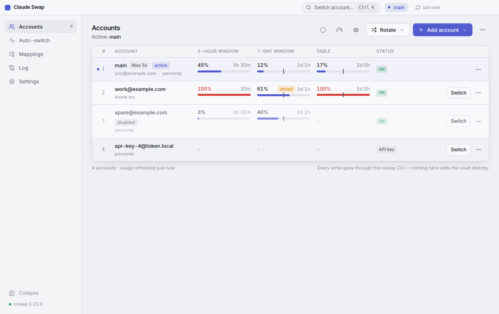
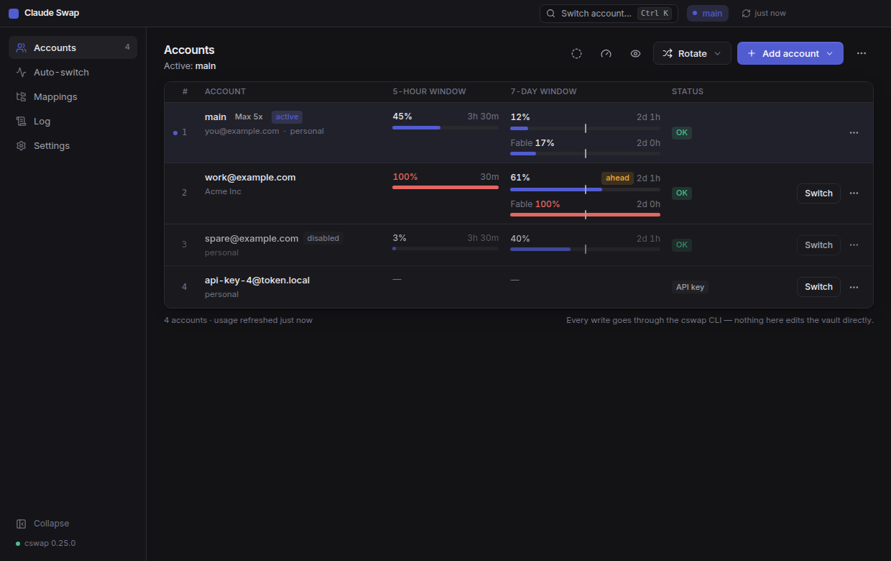

# Claude Swap

A desktop app for [claude-swap](https://github.com/realiti4/claude-swap) (`cswap`) — manage and switch your Claude Code accounts without the terminal. Windows first; Linux and macOS builds come out of the same CI.



## What it does

- **Accounts** — every managed account with its 5-hour and 7-day windows, per-model weekly limits, reset countdowns, pace markers, subscription (Pro / Max 5x / Max 20x) and status (token expired, API key, …), as bars or as rings. Switch with one click, rotate to the next / best / next-available account, or hit <kbd>Ctrl</kbd>+<kbd>K</kbd> and type.
- **Add / remove** — from the current Claude Code login, or from a setup-token / API key (handed to cswap over stdin, never on the command line). Aliases, slot moves and swaps, disable / enable (hold an account out of rotation).
- **Auto-switch** — runs `cswap auto --json` as a child process, shows its event stream live, edits cswap's own settings (`threshold`, `strategy`, `model`, …) and sends a desktop notification when it switches. **Check now** runs a single `cswap auto --once` tick.
- **Session mode** — open a terminal running `cswap run <slot>` from an account's menu or straight from a mapped directory, choosing where it starts (that terminal only; the default login is untouched).
- **Token diagnostics** — `cswap list --token-status` in a dialog when a token misbehaves.
- **Directory mappings** — see and edit the `cswap map` table for session mode (`cswap run`).
- **Export / import** — `.cswap` backups, single account or all, `--full` and `--force` as switches.
- **Tray** — active account and usage in the tooltip, switch from the tray menu, close-to-tray, launch at login.
- **Updates** — the Windows and Linux builds check GitHub releases at start and every six hours, download in the background and install on quit (or on request). macOS is unsigned, so there it is a link to the release.
- **Log** — every cswap call the app made: arguments, exit code, duration, output.
- Not in the UI on purpose: `cswap purge` (deletes every account) — use the CLI if you really mean it.
- Light theme by default (tinted, not plain white), dark theme, or follow the system.

<p>
  
  
</p>

## Install

1. Install cswap once — it serves the terminal, the TUI and this app:
   ```bash
   uv tool install claude-swap    # or: pipx install claude-swap
   ```
   The app finds it in the uv / pipx install directory or on `PATH`; you can also point it at the executable in **Settings**. If cswap is missing, the app offers to run the uv install for you.
2. Download the installer for your platform from [Releases](https://github.com/TheSkinnyRat/cswap-desktop/releases) (Windows: `-setup.exe` or the portable `.exe`; Linux: AppImage / deb; macOS: dmg, unsigned).

## How it works

The app never writes credentials and never talks to Anthropic. **Every read and write goes through the cswap CLI** — `cswap list --json`, `cswap switch 2 --json`, `cswap auto --json`, and so on — so the vault stays consistent with the terminal, the TUI and the macOS menu bar, and cswap's own locks and OAuth handling keep working. The only direct reads are `mappings.json` (for the mappings page), a file watcher on the vault root so changes made from a terminal show up within a second, and two non-secret strings — `subscriptionType` and `rateLimitTier` — from Claude Code's own `.credentials.json`, which is the only place the subscription is written down; cswap does not expose it. Nothing else is read from that file, and only for the account that is live right now. What each account showed while it was active is remembered by email, so the labels survive a switch (on macOS the credentials live in the Keychain, so no label is shown).

Python and claude-swap are deliberately **not** bundled: two cswap versions writing the same vault is how accounts go missing.

```
src/main      Electron main — cswap driver (spawn + JSON), auto-switch runner, vault watcher, tray, IPC
src/preload   contextBridge: window.cswap (typed in src/shared/types.ts)
src/renderer  React + Tailwind UI (works in a plain browser with a mock API for UI work)
test/fake-cswap  a stand-in cswap with the same verbs, --json schema and stdin prompts
```

## Development

```bash
npm ci
npm run dev          # electron-vite with HMR
npm run typecheck
npm test             # vitest: driver against the fake cswap
npm run build && npx playwright test    # Electron e2e against the fake cswap (Linux: xvfb-run -a npx playwright test)
npm run dist:win     # installer + portable exe into release/
```

Useful environment variables while developing or testing:

| Variable | Effect |
| --- | --- |
| `CSWAP_DESKTOP_BIN` | Use this executable instead of auto-detection (a path set in Settings still wins) |
| `CSWAP_DESKTOP_USERDATA` | Where the app keeps its own `settings.json` |
| `FAKE_CSWAP_STATE` | State file for `test/fake-cswap` |
| `CSWAP_REAL=1` | Run the read-only e2e against the cswap installed on this machine |
| `CSWAP_REAL_SWITCH=<slot>` | One real switch to that slot and back, through the UI |
| `CSWAP_REAL_RUN=<slot>` | Open one real session-mode terminal from the UI |

Keyboard: <kbd>Ctrl</kbd>+<kbd>K</kbd> switch account · <kbd>Ctrl</kbd>+<kbd>R</kbd> refresh usage · <kbd>Ctrl</kbd>+<kbd>,</kbd> settings.

Releases: tag `vX.Y.Z` and push the tag — the Release workflow builds Windows, Linux and macOS packages and attaches them to a GitHub release (as a draft; publish it to make the updater see it).

README images are generated, not hand-taken: `DOCS=1 npx playwright test test/e2e/docs.spec.ts` renders them against a fake cswap copied to a neutral path, so no one's directory layout ends up in the repository.

## License

MIT — see [LICENSE](LICENSE). claude-swap is a separate project by [realiti4](https://github.com/realiti4/claude-swap), also MIT.
